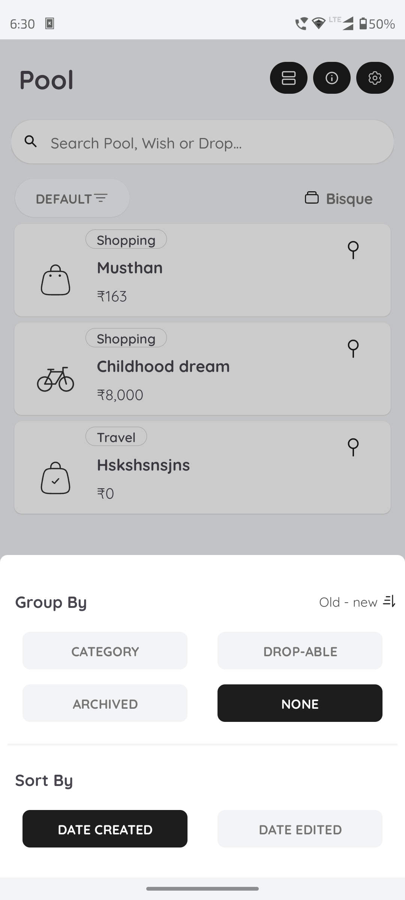
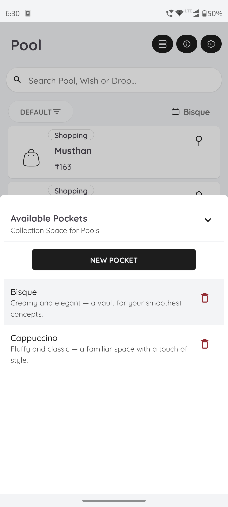
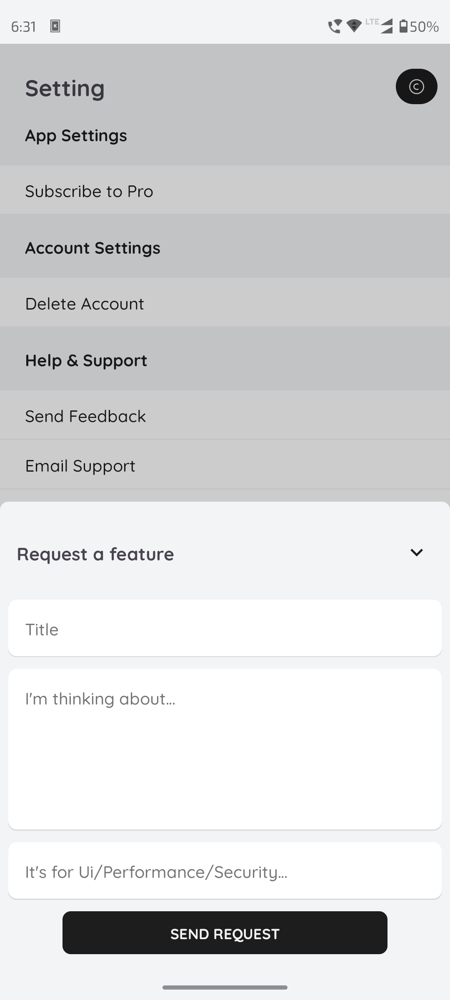

# Slate - Lifecycle-Aware Bottom Sheet Manager

A powerful, lifecycle-aware bottom sheet manager for Android that simplifies bottom sheet
implementation with built-in blur overlays, state management, and automatic cleanup.

## 📱 Screenshots

|                                          |                                          |                                            |
|:----------------------------------------:|:----------------------------------------:|:------------------------------------------:|
|  |  |  |


## ✨ Features

- 🔄 **Lifecycle-Aware**: Automatic cleanup on lifecycle destruction
- 🎨 **Blur Overlay**: Built-in blur background with smooth animations
- 📱 **Back Press Handling**: Smart back navigation support
- 🎯 **State Management**: Easy state transitions with observer pattern
- 🔧 **Customizable**: Strategy pattern for custom transition behaviors
- 🏗️ **Builder Pattern**: Fluent API for easy configuration
- 🧩 **Composite Controls**: Organized button management system
- ♻️ **Memory Safe**: Automatic resource cleanup prevents memory leaks

## 📦 Installation

### Step 1: Add JitPack repository

Add it in your root `settings.gradle` or `build.gradle`:

```gradle
dependencyResolutionManagement {
    repositoriesMode.set(RepositoriesMode.FAIL_ON_PROJECT_REPOS)
    repositories {
        google()
        mavenCentral()
        maven(url = "https://jitpack.io")
    }
}
```

### Step 2: Add the dependency

```gradle
dependencies {
	        implementation ("com.github.Unitx-in:slate:v1.0.0")
	}
```

### Basic Usage

```xml

<?xml version="1.0" encoding="utf-8"?>
<androidx.constraintlayout.widget.ConstraintLayout
    xmlns:android="http://schemas.android.com/apk/res/android"
    xmlns:tools="http://schemas.android.com/tools"
    xmlns:app="http://schemas.android.com/apk/res-auto"
    app:layout_behavior="com.google.android.material.bottomsheet.BottomSheetBehavior"
    android:layout_height="wrap_content"
    android:layout_width="match_parent"
    android:maxWidth="450dp"
    android:background="@android:color/white"
    android:paddingHorizontal="8dp"
    android:paddingBottom="36dp">

    <!--  Important  -->
    <!--  app:layout_behavior="com.google.android.material.bottomsheet.BottomSheetBehavior"-->
    <!--  Important  -->
    
<androidx.constraintlayout.widget.ConstraintLayout>

<!--
Some prebuild xml layouts will be provided in the future for easier bottom sheets setup. 
-->
```

```kotlin
class MyFragment : Fragment() {
    private var _slateAddCategory : Slate<BinderAddCategory>? = null

    override fun onViewCreated(view: View, savedInstanceState: Bundle?) {
        super.onViewCreated(view, savedInstanceState)

        // Quick Way

        _slateAddCategory = SlateBuilderForFragment(
            currentInstance = _slateAddCategory,
            onBind = { hostView ->
                hostView.inflateBinder<BSheetCreateTextBinding, BinderAddCategory> { BinderAddCategory(it) }
            },
            onBindView = { binder ->
                binder.bind(binder.rootView.context) { categoryName->
                    vmUser.onEvent(UserEvent.SaveNewCategory(categoryName))
                    flagCreatedCategoryAutoSelected = true
                }
            }
        ).expand()
        
        // With custom configuration

        _slateAddCategory = SlateBuilder<BinderAddCategory>()
            .peekHeight(200)
            .hideable(true)
            .draggable(true)
            .build(
            currentInstance = _slate,
            hostView = requireView(),
            lifecycleOwner = viewLifecycleOwner,
            onBackPressedDispatcher = requireActivity().onBackPressedDispatcher,
            onBind = { hostView ->
                hostView.inflateBinder<BSheetCreateTextBinding, BinderAddCategory> { BinderAddCategory(it) }
            },
            onBindView = { binder ->
                binder.bind(binder.rootView.context) { categoryName->
                    vmUser.onEvent(UserEvent.SaveNewCategory(categoryName))
                    flagCreatedCategoryAutoSelected = true
                }
            }
        ).expand()
    }

    override fun onDestroy() {
        // Even though it releases the resources with fragment onDestroyView(), but for the safer side. 
        // Personally, i don't write it.
        _slateAddCategory?.release()

        _slateAddCategory = null // This is important. You should always do it!
    }
}
```

### Define Your ViewBinder

```kotlin
class BinderAddCategory(private val sheetBinding: BSheetCreateTextBinding) : Slate.ViewBinder(sheetBinding.root) {
    fun interface OnBinderAddCategoryClickListener{
        fun onCategorySave(categoryName: String)
    }

    fun bind(context: Context, onBinderAddCategoryClickListener: OnBinderAddCategoryClickListener) {
        sheetBinding.apply {
            setCollapseBtn = null
            setSaveBtn = bCtIvSave
            onStateChangedFromBinder = { state ->
                // Handle state changes
            }
            
            bCtTvName.text = ContextCompat.getString(context, R.string.title_category)
            bCtEtName.hint = ContextCompat.getString(context, R.string.desc_category)
            bCtTvDescription.text = ContextCompat.getString(context, R.string.hint_category_error)
            bTvSignalError.text = context.getString(R.string.signal_init_range, 0, LiveInputRange.CATEGORY_RANGE.last)
            
                // ...
                // More code as required
                // ...

            bCtIvSave.appendClickListener({
                onBinderAddCategoryClickListener.onCategorySave(bCtEtName.text.toString())
                bCtEtName.text?.clear()
            })
        }
    }
}
```

## 📖 Usage Examples

### 1. Basic Configuration

```kotlin
private var slate : Slate<Binder>? = null

val slate = SlateBuilder<Binder>()
    .peekHeight(300)                    // Height when collapsed
    .fitToContents(true)                // Fit to content height
    .hideable(true)                     // Can be hidden by dragging
    .skipCollapsed(false)               // Show collapsed state
    .draggable(true)                    // User can drag
    .halfExpandedRatio(0.5f)            // Half-expanded at 50%
    .build() // build(...)
    .expand()
```

### 2. State Management

```kotlin
// Expand the sheet
slate?.expand()

// Collapse to peek height
slate?.collapse()

// Hide completely
slate?.hide()

// Set specific state
slate?.setState(BottomSheetBehavior.STATE_HALF_EXPANDED)

// Check current state
if (slate?.isExpanded == true) {
    // Sheet is expanded
}
```

### 3. State Change Observers

#### Option A: Simple Lambda

```kotlin
SlateBuilder<Binder>()
    .onStateChange { state ->
        when (state) {
            BottomSheetBehavior.STATE_EXPANDED -> handleExpanded()
            BottomSheetBehavior.STATE_COLLAPSED -> handleCollapsed()
            BottomSheetBehavior.STATE_HIDDEN -> handleHidden()
        }
    }
    .build(...)
```

#### Option B: Multiple Observers

```kotlin
val analyticsObserver = object : SlateOnStateChangeObserver {
    override fun onStateChanged(state: Int) {
        logAnalyticsEvent("sheet_state", state)
    }
}

val uiObserver = object : SlateOnStateChangeObserver {
    override fun onStateChanged(state: Int) {
        updateUI(state)
    }

    override fun onSlide(offset: Float) {
        updateParallaxEffect(offset)
    }
}

SlateBuilder<Binder>()
    .addObserver(analyticsObserver)
    .addObserver(uiObserver)
    .build(...)
```

#### Option C: ViewBinder Callback

```kotlin
class Binder(private val binding: BottomSheetLayoutBinding) : Slate.ViewBinder(BottomSheetLayoutBinding.root) {
    fun bind(){
        onStateChangedFromBinder = { state ->
            // Handle state changes
        }
    }
}
```

### 4. Custom State Transitions

Create a custom strategy for unique transition effects:

```kotlin
class CustomTransitionStrategy : StateTransitionStrategy<Binder> {
    override fun onExpanded(slate: Slate<Binder>) {
        slate.arrowDown()
        slate.blurVisible()
        // Add custom behavior
        slate.binder.headerView.animate().alpha(1f).start()
        vibrate()
    }

    override fun onCollapsed(slate: Slate<Binder>) {
        slate.arrowUp()
        slate.blurHide()
        slate.binder.headerView.animate().alpha(0.5f).start()
    }

    override fun onHidden(slate: Slate<Binder>) {
        slate.blurHide()
        logEvent("sheet_dismissed")
    }

    override fun onSlide(slate: Slate<Binder>, slideOffset: Float) {
        slate.blurOffSet(slideOffset)
        // Custom parallax effect
        slate.binder.backgroundView.translationY = slideOffset * 100
    }
}

// Use the custom strategy
SlateBuilder<Binder>()
    .stateTransitionStrategy(CustomTransitionStrategy())
    .build(...)
```

### 5. External BottomSheetCallback

For direct BottomSheetBehavior integration:

```kotlin
val externalCallback = object : BottomSheetBehavior.BottomSheetCallback() {
    override fun onStateChanged(bottomSheet: View, newState: Int) {
        // Your custom logic
    }

    override fun onSlide(bottomSheet: View, slideOffset: Float) {
        // Your slide logic
    }
}

SlateBuilder<Binder>()
    .bottomSheetCallback(externalCallback)
    .build(...)
```

### 6. Singleton Pattern Support

Maintain single instance across configuration changes:

```kotlin
class MyFragment : Fragment() {
    private var slate: Slate<Binder>? = null

    override fun onViewCreated(view: View, savedInstanceState: Bundle?) {
        super.onViewCreated(view, savedInstanceState)

        slate = SlateBuilder<Binder>()
            .peekHeight(200)
            .build(
                currentInstance = slate,  // Reuse existing instance
                hostView = binding.container,
                lifecycleOwner = viewLifecycleOwner,
                onBackPressedDispatcher = requireActivity().onBackPressedDispatcher,
                bindingListener = createBindingListener()
            )
    }
}
```

## 🎨 Customization

### Overlay Colors

```kotlin
class Binder(private val binding: BottomSheetLayoutBinding) : Slate.ViewBinder(BottomSheetLayoutBinding.root) {
    fun bind(){
        setOverlayColor = OverlayColor.Light  // or OverlayColor.Dark
    }
}
```

### Auto-Hide Buttons

Slate automatically hides the sheet when these buttons are clicked:

```kotlin
class Binder(private val binding: BottomSheetLayoutBinding) : Slate.ViewBinder(BottomSheetLayoutBinding.root) {
    fun bind(){
        binding.apply{
            setSaveBtn = saveBtn     // Auto-hides on click
            setAddNewBtn = addNewBtn  // Auto-hides on click
            setCollapseBtn = collapseBtn// Toggle expand/collapse
        }
    }
}
```

### Collapse Button Behavior

The collapse button automatically:

- Shows ↓ arrow when expanded
- Shows ↑ arrow when collapsed
- Toggles between states on click
- Hides sheet if `skipCollapsed = true`

## 🏗️ Architecture

Slate uses multiple design patterns for clean, maintainable code:

### Design Patterns Used

1. **Builder Pattern** - Fluent API for configuration
2. **Strategy Pattern** - Customizable state transitions
3. **Observer Pattern** - Multiple state change listeners
4. **Composite Pattern** - Organized button management
5. **Facade Pattern** - Simplified BottomSheetBehavior API

### Component Overview

```
┌─────────────────────────────────────────────────────────┐
│                    SlateBuilder                          │
│              (Configuration & Creation)                  │
└────────────────────┬────────────────────────────────────┘
                     │
                     ↓
┌─────────────────────────────────────────────────────────┐
│                       Slate                              │
│              (Main Coordinator Class)                    │
└──┬────────────┬──────────────┬─────────────┬───────────┘
   │            │              │             │
   ↓            ↓              ↓             ↓
┌──────┐  ┌──────────┐  ┌──────────┐  ┌──────────┐
│State │  │  Slate   │  │  Slate   │  │  Slate   │
│Trans │  │Behaviour │  │Controls  │  │Observer  │
│Strategy│  │(Facade)  │  │Composite │  │Observable│
└──────┘  └──────────┘  └──────────┘  └──────────┘
```

## 📋 API Reference

### SlateBuilder Methods

| Method                              | Description                           |
|-------------------------------------|---------------------------------------|
| `peekHeight(Int)`                   | Height when collapsed (default: 0)    |
| `initialState(Int)`                 | Initial state (default: STATE_HIDDEN) |
| `fitToContents(Boolean)`            | Fit to content height (default: true) |
| `hideable(Boolean)`                 | Can be hidden (default: true)         |
| `skipCollapsed(Boolean)`            | Skip collapsed state (default: false) |
| `draggable(Boolean)`                | User can drag (default: true)         |
| `halfExpandedRatio(Float)`          | Half-expanded ratio (default: 0.5f)   |
| `stateTransitionStrategy(Strategy)` | Custom transition strategy            |
| `bottomSheetCallback(Callback)`     | External BottomSheet callback         |
| `addObserver(Observer)`             | Add state change observer             |
| `onStateChange(Lambda)`             | Simple state change callback          |
| `build(...)`                        | Build and initialize Slate instance   |


### Slate Methods

| Method          | Description             |
|-----------------|-------------------------|
| `expand()`      | Expand to full height   |
| `collapse()`    | Collapse to peek height |
| `hide()`        | Hide completely         |
| `setState(Int)` | Set specific state      |
| `release()`     | Clean up resources      |
| `isExpanded`    | Check if expanded       |
| `isCollapsed`   | Check if collapsed      |
| `isHidden`      | Check if hidden         |

### ViewBinder Properties

| Property                   | Type               | Description                   |
|----------------------------|--------------------|-------------------------------|
| `setSaveBtn`               | `ImageView?`       | Button that auto-hides sheet  |
| `setCollapseBtn`           | `RadioImage?`      | Toggle expand/collapse button |
| `setAddNewBtn`             | `View?`            | Button that auto-hides sheet  |
| `setOverlayColor`          | `OverlayColor`     | Blur overlay color theme      |
| `onStateChangedFromBinder` | `((Int) -> Unit)?` | State change callback         |

## ⚠️ Important Notes

### Memory Management

```kotlin
override fun onDestroyView() {
    slate?.release() // Optional
    slate = null
    super.onDestroyView()
}
```

### Lifecycle Awareness

Slate automatically:

- Removes callbacks on lifecycle destruction
- Cleans up views and observers
- Prevents memory leaks

### Thread Safety

All state changes are posted to the main thread:

```kotlin
slate?.expand()  // Safe to call from any thread
```

## 🐛 Troubleshooting

### Sheet not visible

```kotlin
// Make sure to call expand() after build()
slate = SlateBuilder<Binder>()
    .build(...)
.expand()  // ← Don't forget this!
```

### Back press not working

```kotlin
// Ensure you pass the correct dispatcher
.build(
    onBackPressedDispatcher = requireActivity().onBackPressedDispatcher,
    // ...
)
```

### State changes not triggering

```kotlin
// Add observer before building
SlateBuilder<Binder>()
    .onStateChange { state -> /* ... */ }  // ← Before build()
    .build(...)
```

## 🤝 Contributing

Contributions are welcome! Please feel free to submit a Pull Request.

1. Fork the repository
2. Create your feature branch (`git checkout -b feature/AmazingFeature`)
3. Commit your changes (`git commit -m 'Add some AmazingFeature'`)
4. Push to the branch (`git push origin feature/AmazingFeature`)
5. Open a Pull Request

## 📧 Support

- Create an [Issue](https://github.com/Unitx-in/Slate/issues)
- Email: developer@unitx.in
- You can contact me on the above email directly, if you have any problem using the library. 

## 🌟 Show your support

Give a ⭐️ if this project helped you!

---

Made with ❤️ by [Navneet/Unitx]